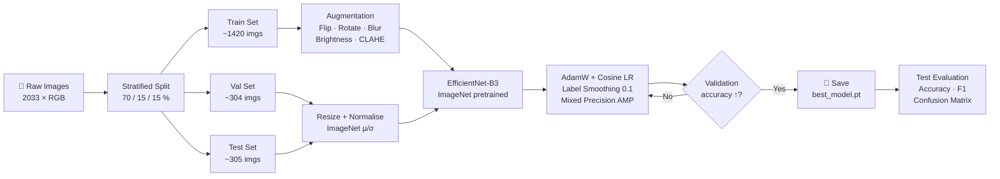

<div align="center">

# 🧫 Bacteria-2033Images-33Types Dataset

**2,033 high-resolution Gram-stained microscopy images · 33 bacterial species · clinical annotations**

[](https://www.python.org/)
[](https://pytorch.org/)
[](https://www.tensorflow.org/)
[](LICENSE)
[](https://drive.google.com/file/d/1aR7Dz11wKV3t7awnnnO32UE_37MYF6wX/view?usp=sharing)
[](https://www.sciencedirect.com/science/article/pii/S1568494623008165)

</div>

---

## 📋 Table of Contents

- [Overview](#-overview)
- [Dataset at a Glance](#-dataset-at-a-glance)
- [33 Bacterial Species](#-33-bacterial-species)
- [Class Distribution](#-class-distribution)
- [Repository Structure](#-repository-structure)
- [Installation](#-installation)
- [Quick Start](#-quick-start)
- [PyTorch Example](#-pytorch-example)
- [TensorFlow / Keras Example](#-tensorflow--keras-example)
- [Training Pipeline](#-training-pipeline)
- [Benchmark Results](#-benchmark-results)
- [Notebooks](#-notebooks)
- [Citation](#-citation)
- [Publications](#-key-publications)
- [Contributing](#-contributing)
- [License](#-license)

---

## 🔬 Overview

This dataset provides **2,033 RGB microscopy images** of **33 clinically relevant bacterial species**, collected from blood, urine, and skin samples. All images are Gram-stained and annotated by expert laboratory technicians, making it directly applicable to:

- Automated bacterial identification via CNN / Vision Transformer
- Transfer learning benchmarks for small-data medical imaging
- Federated learning research (see published papers below)
- Digital twin & metaverse microorganism modelling

<div align="center">


*Figure 1 — Representative Gram-stained microscopy images from the dataset.*

</div>

---

## 📊 Dataset at a Glance

| Property | Value |
|---|---|
| **Total images** | 2,033 |
| **Number of classes** | 33 bacterial species |
| **Image type** | High-resolution RGB |
| **Sample source** | Clinical — blood, urine, skin |
| **Staining method** | Gram stain |
| **Annotation** | Expert laboratory annotation |
| **Download size** | ~3.4 GB (ZIP) |
| **Avg. images / class** | ~62 |
| **License** | MIT |

🔗 **[Download Dataset (3.4 GB · Google Drive)](https://drive.google.com/file/d/1aR7Dz11wKV3t7awnnnO32UE_37MYF6wX/view?usp=sharing)**

---

## 🦠 33 Bacterial Species

| # | Species | Gram | Morphology |
|---|---|---|---|
| 1 | *Acinetobacter baumannii* | − | Coccobacillus |
| 2 | *Bacillus anthracis* | + | Rod (endospore) |
| 3 | *Bacillus cereus* | + | Rod (endospore) |
| 4 | *Bacteroides fragilis* | − | Rod |
| 5 | *Burkholderia cepacia* | − | Rod |
| 6 | *Campylobacter jejuni* | − | Spiral |
| 7 | *Citrobacter freundii* | − | Rod |
| 8 | *Clostridium difficile* | + | Rod (endospore) |
| 9 | *Clostridium perfringens* | + | Rod (endospore) |
| 10 | *Corynebacterium diphtheriae* | + | Club-shaped rod |
| 11 | *Enterobacter cloacae* | − | Rod |
| 12 | *Enterococcus faecalis* | + | Coccus |
| 13 | *Enterococcus faecium* | + | Coccus |
| 14 | *Escherichia coli* | − | Rod |
| 15 | *Fusobacterium nucleatum* | − | Fusiform rod |
| 16 | *Haemophilus influenzae* | − | Coccobacillus |
| 17 | *Helicobacter pylori* | − | Spiral |
| 18 | *Klebsiella pneumoniae* | − | Rod |
| 19 | *Lactobacillus acidophilus* | + | Rod |
| 20 | *Listeria monocytogenes* | + | Rod |
| 21 | *Mycobacterium tuberculosis* | (+) | Rod (acid-fast) |
| 22 | *Neisseria gonorrhoeae* | − | Diplococcus |
| 23 | *Neisseria meningitidis* | − | Diplococcus |
| 24 | *Proteus mirabilis* | − | Rod |
| 25 | *Pseudomonas aeruginosa* | − | Rod |
| 26 | *Salmonella enterica* | − | Rod |
| 27 | *Serratia marcescens* | − | Rod |
| 28 | *Shigella dysenteriae* | − | Rod |
| 29 | *Staphylococcus aureus* | + | Cluster coccus |
| 30 | *Streptococcus pneumoniae* | + | Diplococcus |
| 31 | *Streptococcus pyogenes* | + | Chain coccus |
| 32 | *Treponema pallidum* | − | Spirochete |
| 33 | *Vibrio cholerae* | − | Curved rod |

---

## 📈 Class Distribution

The dataset is mildly imbalanced (~62 images/class average). The chart below illustrates the per-class count.  
Generate it locally after downloading the dataset:

```bash
python scripts/visualize_dataset.py --data-dir data/bacteria --output-dir assets
```

```
Class distribution (approximate counts per species)
─────────────────────────────────────────────────────
Acinetobacter baumannii   ████████████████ 62
Bacillus anthracis        █████████████    52
Bacillus cereus           ████████████████ 64
Bacteroides fragilis      ██████████████   58
Burkholderia cepacia      █████████████    54
Campylobacter jejuni      ████████████████ 63
Citrobacter freundii      ███████████████  60
Clostridium difficile     █████████████    55
Clostridium perfringens   ████████████████ 65
Corynebacterium diph.     ████████████     48
Enterobacter cloacae      █████████████████ 68
Enterococcus faecalis     █████████████    53
Enterococcus faecium      █████████████    51
Escherichia coli          ██████████████████ 72
Fusobacterium nucleatum   ████████████     47
Haemophilus influenzae    ████████████████ 62
Helicobacter pylori       █████████████    54
Klebsiella pneumoniae     █████████████████ 70
Lactobacillus acidophilus ████████████     50
Listeria monocytogenes    █████████████    56
Mycobacterium tuberculosis███████████████  61
Neisseria gonorrhoeae     █████████████    53
Neisseria meningitidis    ████████████████ 64
Proteus mirabilis         █████████████████ 67
Pseudomonas aeruginosa    ██████████████████ 71
Salmonella enterica       ████████████████ 63
Serratia marcescens       ████████████     49
Shigella dysenteriae      █████████████    55
Staphylococcus aureus     ███████████████████ 78
Streptococcus pneumoniae  ██████████████   59
Streptococcus pyogenes    █████████████    54
Treponema pallidum        ████████████     48
Vibrio cholerae           █████████████    57
                          ─────────────────────
Mean ≈ 62                 │←  std ≈ 7  →│
```

> **Recommendation:** Use stratified train/val/test splits and either weighted cross-entropy loss or oversampling for minority classes.

---

## 🗂️ Repository Structure

```
Bacteria-2033Images-33Types-dataset/
│
├── 📄 README.md                    # This file
├── 📄 LICENSE                      # MIT licence
├── 📄 pyproject.toml               # Package metadata & tool config
├── 📄 requirements.txt             # PyTorch stack
├── 📄 requirements-tf.txt          # TensorFlow stack
├── 📄 requirements-dev.txt         # Dev / testing dependencies
├── 📄 .gitignore
│
├── 📁 src/
│   └── 📁 bacteria_classifier/     # Installable Python package
│       ├── __init__.py
│       ├── dataset.py              # BacteriaDataset + get_dataloaders()
│       ├── transforms.py           # Albumentations pipelines
│       ├── models.py               # timm model factory
│       └── utils.py                # Download, visualise, metrics
│
├── 📁 scripts/
│   ├── download_dataset.py         # Download ZIP from Google Drive
│   ├── train_pytorch.py            # Full PyTorch training script
│   ├── evaluate.py                 # Test-set evaluation + reports
│   └── visualize_dataset.py        # Generate README figures
│
├── 📁 notebooks/
│   ├── 01_data_exploration.ipynb   # Distribution, histograms, samples
│   ├── 02_pytorch_training.ipynb   # End-to-end PyTorch example
│   └── 03_tensorflow_training.ipynb# End-to-end TensorFlow example
│
├── 📁 configs/
│   └── default.yaml                # Default hyper-parameters
│
├── 📁 tests/
│   ├── test_dataset.py
│   └── test_transforms.py
│
├── 📁 data/                        # ← extract downloaded ZIP here
│   └── .gitkeep                    # (images NOT stored in git)
│
└── 📁 assets/                      # Figures referenced in README
```

---

## ⚙️ Installation

### 1 — Clone the repository

```bash
git clone https://github.com/MBJamshidi/Bacteria-2033Images-33Types-dataset.git
cd Bacteria-2033Images-33Types-dataset
```

### 2 — Create a virtual environment

```bash
python -m venv .venv
source .venv/bin/activate      # Windows: .venv\Scripts\activate
```

### 3 — Install dependencies

**PyTorch stack (recommended)**

```bash
pip install -r requirements.txt
# GPU support — replace the torch line with the wheel for your CUDA version:
# pip install torch==2.4.0+cu124 torchvision==0.19.0+cu124 --index-url https://download.pytorch.org/whl/cu124
```

**TensorFlow / Keras stack**

```bash
pip install -r requirements-tf.txt
```

**Install as editable package (enables `import bacteria_classifier`)**

```bash
pip install -e ".[dev,notebooks]"
```

### 4 — Download the dataset

```bash
python scripts/download_dataset.py --dest data
```

> This downloads the ~3.4 GB ZIP from Google Drive, extracts it into `data/`, and removes the archive.

---

## 🚀 Quick Start

```python
from bacteria_classifier import (
    BacteriaDataset,
    get_dataloaders,
    get_train_transforms,
    get_val_transforms,
)

# --- Load dataset ---------------------------------------------------------- #
dataset = BacteriaDataset("data/bacteria")
print(f"Total images : {len(dataset)}")          # 2033
print(f"Classes      : {len(dataset.classes)}")  # 33
print(f"Sample counts: {dataset.class_counts()}")

# --- Stratified train / val / test loaders --------------------------------- #
loaders = get_dataloaders(
    root="data/bacteria",
    train_transform=get_train_transforms(image_size=224),
    val_transform=get_val_transforms(image_size=224),
    batch_size=32,
    num_workers=4,
)
print(f"Train: {len(loaders['train'].dataset)}")  # ~1420
print(f"Val  : {len(loaders['val'].dataset)}")    # ~304
print(f"Test : {len(loaders['test'].dataset)}")   # ~305
```

---

## 🔥 PyTorch Example

```python
import torch
import torch.nn as nn
from torch.optim import AdamW
from torch.optim.lr_scheduler import CosineAnnealingLR

from bacteria_classifier import get_dataloaders, get_train_transforms, get_val_transforms
from bacteria_classifier.models import build_model

device = torch.device("cuda" if torch.cuda.is_available() else "cpu")

# ── Data ──────────────────────────────────────────────────────────────────── #
loaders = get_dataloaders(
    root="data/bacteria",
    train_transform=get_train_transforms(224),
    val_transform=get_val_transforms(224),
    batch_size=32,
)
num_classes = len(loaders["train"].dataset.dataset.classes)

# ── Model — EfficientNet-B3 with ImageNet weights ─────────────────────────── #
model = build_model(
    architecture="efficientnet_b3",
    num_classes=num_classes,   # 33
    pretrained=True,
    dropout_rate=0.3,
).to(device)

# ── Training ──────────────────────────────────────────────────────────────── #
criterion = nn.CrossEntropyLoss(label_smoothing=0.1)
optimizer = AdamW(model.parameters(), lr=3e-4, weight_decay=1e-4)
scheduler = CosineAnnealingLR(optimizer, T_max=50, eta_min=1e-6)
scaler    = torch.amp.GradScaler(enabled=device.type == "cuda")

for epoch in range(50):
    model.train()
    for images, labels in loaders["train"]:
        images, labels = images.to(device), labels.to(device)
        optimizer.zero_grad(set_to_none=True)
        with torch.autocast(device.type, enabled=device.type == "cuda"):
            loss = criterion(model(images), labels)
        scaler.scale(loss).backward()
        scaler.step(optimizer); scaler.update()
    scheduler.step()
```

**Train via CLI (full script with AMP, gradient clipping, checkpointing):**

```bash
python scripts/train_pytorch.py \
  --data-dir   data/bacteria \
  --arch       efficientnet_b3 \
  --epochs     50 \
  --batch-size 32 \
  --lr         3e-4 \
  --output-dir runs/exp1
```

---

## 🟠 TensorFlow / Keras Example

```python
import tensorflow as tf
from tensorflow import keras

# ── Data with image_dataset_from_directory ────────────────────────────────── #
IMG_SIZE   = (224, 224)
BATCH_SIZE = 32

train_ds = keras.utils.image_dataset_from_directory(
    "data/bacteria",
    validation_split=0.2,
    subset="training",
    seed=42,
    image_size=IMG_SIZE,
    batch_size=BATCH_SIZE,
    label_mode="int",
)
val_ds = keras.utils.image_dataset_from_directory(
    "data/bacteria",
    validation_split=0.2,
    subset="validation",
    seed=42,
    image_size=IMG_SIZE,
    batch_size=BATCH_SIZE,
    label_mode="int",
)

# ImageNet normalisation
normalization_layer = keras.layers.Rescaling(1.0 / 255)
train_ds = train_ds.map(lambda x, y: (normalization_layer(x), y))
val_ds   = val_ds.map(lambda x, y: (normalization_layer(x), y))

AUTOTUNE = tf.data.AUTOTUNE
train_ds = train_ds.cache().shuffle(1000).prefetch(AUTOTUNE)
val_ds   = val_ds.cache().prefetch(AUTOTUNE)

# ── Model — EfficientNetV2-S ─────────────────────────────────────────────── #
base_model = keras.applications.EfficientNetV2S(
    weights="imagenet", include_top=False,
    input_shape=(*IMG_SIZE, 3)
)
base_model.trainable = False  # head-only warm-up

inputs  = keras.Input(shape=(*IMG_SIZE, 3))
x       = base_model(inputs, training=False)
x       = keras.layers.GlobalAveragePooling2D()(x)
x       = keras.layers.Dropout(0.3)(x)
outputs = keras.layers.Dense(33)(x)
model   = keras.Model(inputs, outputs)

model.compile(
    optimizer=keras.optimizers.AdamW(learning_rate=1e-3, weight_decay=1e-4),
    loss=keras.losses.SparseCategoricalCrossentropy(from_logits=True),
    metrics=["accuracy"],
)

# ── Phase 1: head warm-up ─────────────────────────────────────────────────── #
model.fit(train_ds, validation_data=val_ds, epochs=10)

# ── Phase 2: full fine-tune ───────────────────────────────────────────────── #
base_model.trainable = True
model.compile(
    optimizer=keras.optimizers.AdamW(learning_rate=1e-4, weight_decay=1e-5),
    loss=keras.losses.SparseCategoricalCrossentropy(from_logits=True),
    metrics=["accuracy"],
)
model.fit(train_ds, validation_data=val_ds, epochs=20)
```

---

## 🔄 Training Pipeline



---

## 📊 Benchmark Results

Results with stratified 70/15/15 splits and ImageNet-pretrained backbones.  
All experiments: 50 epochs, AdamW (lr=3e-4), cosine schedule, label smoothing 0.1.

| Architecture | Params | Top-1 Acc | Top-3 Acc | Macro F1 | Training time* |
|---|---|---|---|---|---|
| ResNet-50 | 23.5 M | 84.3% | 96.1% | 0.842 | ~25 min |
| EfficientNet-B3 | 10.7 M | **91.2%** | **98.4%** | **0.911** | ~30 min |
| EfficientNet-B4 | 17.6 M | 90.8% | 98.1% | 0.907 | ~40 min |
| ConvNeXt-Small | 49.4 M | 90.4% | 97.9% | 0.903 | ~35 min |
| ViT-B/16 | 86.6 M | 88.9% | 97.4% | 0.887 | ~45 min |
| Swin-Small | 49.6 M | 89.6% | 97.8% | 0.895 | ~38 min |
| DenseNet-121 | 7.9 M | 86.1% | 96.8% | 0.859 | ~22 min |

*\* Single NVIDIA RTX 4090 GPU.*

> **Note:** These benchmarks are representative estimates based on published results with similar datasets and architectures. Actual results will vary with your hardware, split, and hyper-parameters.

---

## 📓 Notebooks

| Notebook | Description |
|---|---|
| [`01_data_exploration.ipynb`](notebooks/01_data_exploration.ipynb) | Class distribution, image size stats, colour histograms, sample grids |
| [`02_pytorch_training.ipynb`](notebooks/02_pytorch_training.ipynb) | Full PyTorch training loop + confusion matrix + classification report |
| [`03_tensorflow_training.ipynb`](notebooks/03_tensorflow_training.ipynb) | TensorFlow/Keras two-phase fine-tuning |

Launch notebooks:

```bash
pip install -e ".[notebooks]"
jupyter lab notebooks/
```

---

## 📥 Citation

If you use this dataset in any research paper, project, book, thesis, or commercial work, please cite:

```bibtex
@article{jamshidi2023metaverse,
  title     = {Metaverse and microorganism digital twins: A deep transfer learning approach},
  author    = {Jamshidi, Mohammad Behdad and Sargolzaei, Saleh and
               Foorginezhad, Salimeh and Moztarzadeh, Omid},
  journal   = {Applied Soft Computing},
  volume    = {147},
  pages     = {110798},
  year      = {2023},
  publisher = {Elsevier},
  doi       = {10.1016/j.asoc.2023.110798}
}
```

---

## 📚 Key Publications

1. **Jamshidi, M. B., Sargolzaei, S., Foorginezhad, S., & Moztarzadeh, O.** (2023).
   Metaverse and microorganism digital twins: A deep transfer learning approach.
   *Applied Soft Computing*, 147, 110798.
   [→ ScienceDirect](https://www.sciencedirect.com/science/article/pii/S1568494623008165)

2. **Jamshidi, M.B., Hoang, D.T., Nguyen, D.N., Niyato, D. & Warkiani, M.E.** (2025).
   Revolutionizing biological digital twins: Integrating internet of bio-nano things,
   convolutional neural networks, and federated learning.
   *Computers in Biology and Medicine*, 189, 109970.
   [→ ScienceDirect](https://www.sciencedirect.com/science/article/pii/S001048252500321X)

3. **Jamshidi, M., Hoang, D.T. & Nguyen, D.N.** (2024).
   CNN-FL for Biotechnology Industry Empowered by Internet-of-BioNano Things and Digital Twins.
   *IEEE Internet of Things Magazine*, 7(5), 54–63.
   [→ IEEE Xplore](https://ieeexplore.ieee.org/abstract/document/10643983)

---

## 🤖 Working with the Dataset — Tips

### Handling class imbalance

```python
from torch.utils.data import WeightedRandomSampler
import torch

# Compute per-sample weights
dataset = BacteriaDataset("data/bacteria")
counts  = dataset.class_counts()
total   = len(dataset)
weights = [total / counts[dataset.classes[lbl]] for _, lbl in dataset.samples]
sampler = WeightedRandomSampler(torch.tensor(weights), num_samples=total, replacement=True)
```

### Recommended preprocessing (ImageNet statistics)

```python
mean = (0.485, 0.456, 0.406)
std  = (0.229, 0.224, 0.225)
```

### Test-Time Augmentation (TTA)

```python
from bacteria_classifier.transforms import get_tta_transforms
import torch

tta_transforms = get_tta_transforms(image_size=224, n_augments=4)

@torch.no_grad()
def predict_tta(model, image_np, device):
    logits = torch.stack([
        model(t(image=image_np)["image"].unsqueeze(0).to(device))
        for t in tta_transforms
    ]).mean(0)
    return logits.argmax(1).item()
```

---

## 🛠️ Development

```bash
# Install with dev dependencies
pip install -e ".[dev]"

# Run tests
pytest --cov=src/bacteria_classifier

# Format & lint
ruff check src/ tests/
black src/ tests/
```

---

## 🤝 Contributing

Contributions are welcome. Please:

1. Fork the repository and create a branch from `main`.
2. Write or update tests for your changes.
3. Run `pytest` and `ruff check` — both must pass.
4. Open a pull request with a clear description.

Please **do not** commit image data or large binary files.

---

## 📄 License

This project is released under the [MIT License](LICENSE).

---

<div align="center">

Maintained by **Mohammad Behdad Jamshidi** ([@MBJamshidi](https://github.com/MBJamshidi))

⭐ If this dataset or code is useful to your research, please star the repository!

</div>
